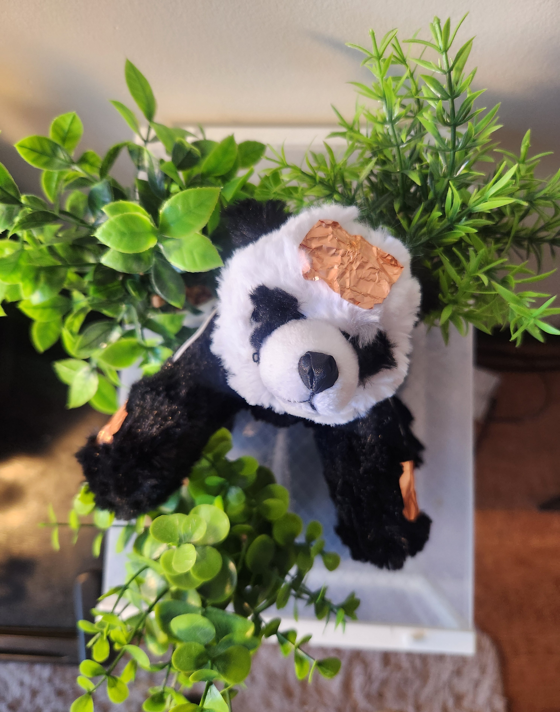
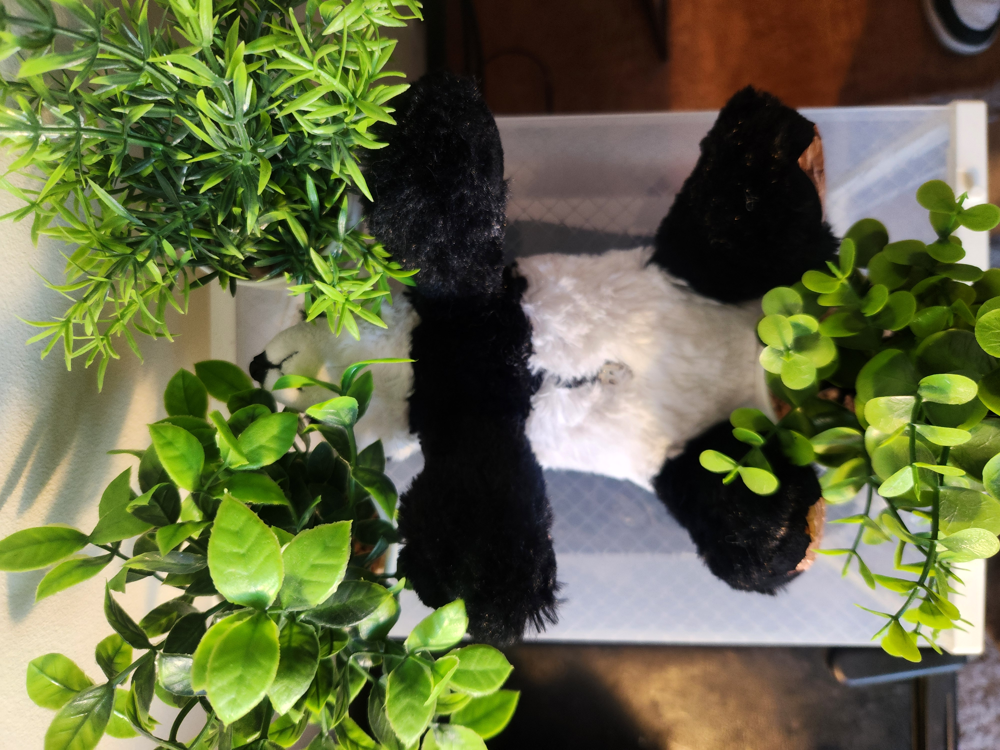
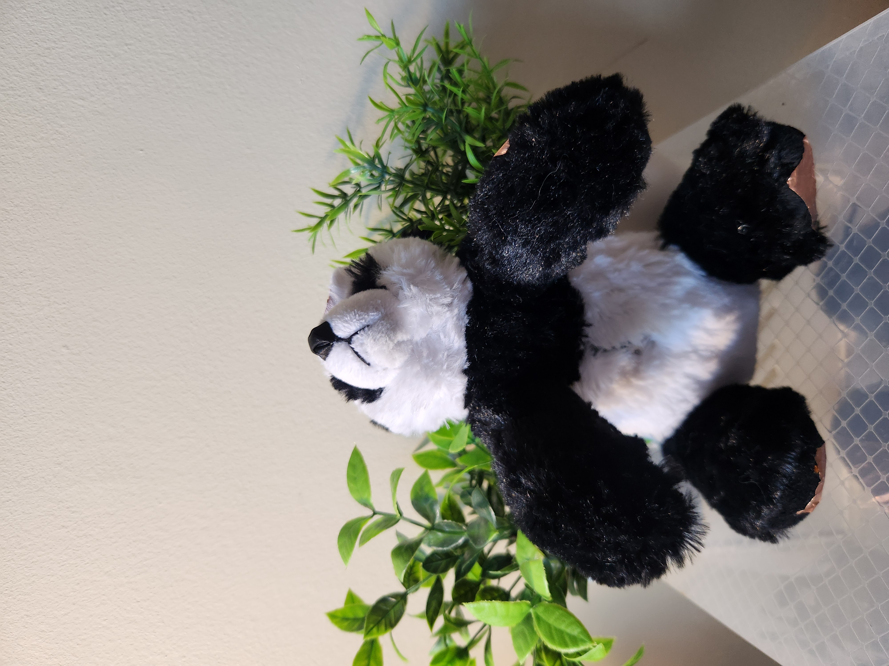
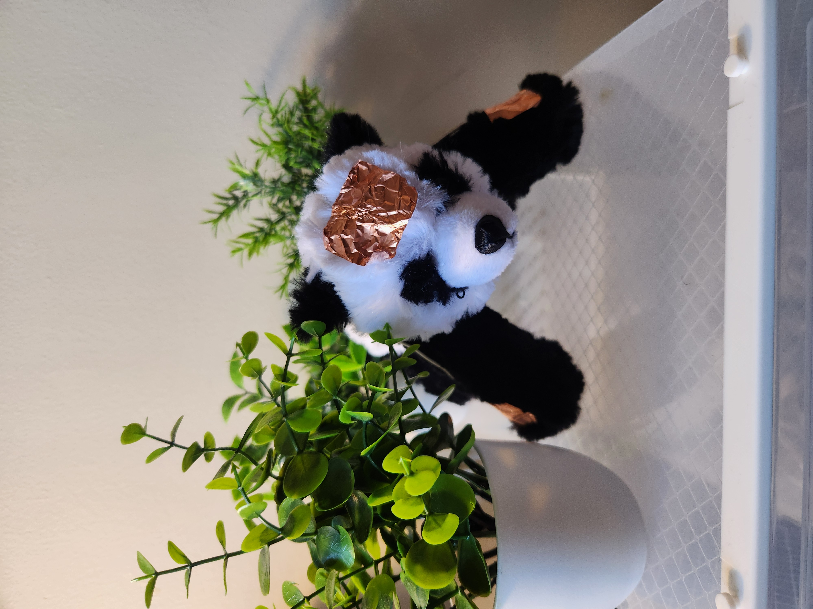
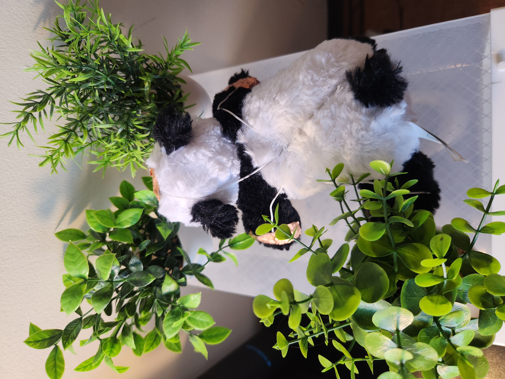

# Interactive Panda — ESP32

An interactive panda sculpture built with an ESP32, servo motors, and copper tape touch sensors. The panda reacts to physical touch by moving its limbs, blending soft sculpture aesthetics with embedded electronics in a visible, augmented-exoskeleton style.

---

## Hardware Requirements

| Component | Details |
|---|---|
| Microcontroller | ESP32 (any standard DevKit) |
| Actuators | Servo motors (one per moving limb) |
| Touch sensors | Copper tape strips wired to ESP32 touch-capable GPIO pins |
| Power | USB or 3.7 V LiPo battery |
| Structure | Plush panda toy (body modified to route wiring) |
| Misc | Jumper wires, heat-shrink tubing, double-sided tape |

---

## Software Dependencies

- [Arduino IDE](https://www.arduino.cc/en/software) 2.x **or** [PlatformIO](https://platformio.org/)
- [ESP32Servo](https://github.com/madhephaestus/ESP32Servo) library
- Board support: **ESP32** via Arduino Board Manager (`https://raw.githubusercontent.com/espressif/arduino-esp32/gh-pages/package_esp32_index.json`)

---

## Installation

### 1 — Set up the Arduino IDE

1. Open **File → Preferences** and add the ESP32 board manager URL above.
2. Go to **Tools → Board → Boards Manager**, search for *esp32*, and install the Espressif package.
3. Install the **ESP32Servo** library via **Tools → Manage Libraries**.

### 2 — Wiring

| ESP32 Pin | Connected to |
|---|---|
| GPIO 4 (Touch) | Copper tape sensor — left paw |
| GPIO 2 (Touch) | Copper tape sensor — right paw |
| GPIO 13 | Servo signal — left arm |
| GPIO 14 | Servo signal — right arm |
| 5 V / GND | Servo power rails |

> Adjust pin numbers in `config.h` to match your build.

### 3 — Flash the sketch

1. Connect the ESP32 via USB.
2. Select the matching board under **Tools → Board → ESP32 Arduino**.
3. Open `interactive_panda.ino` and click **Upload**.

---

## Usage

Once powered on, the panda is idle. Touching the copper tape strips triggers the corresponding servo to animate the limb. Release the tape to return to the rest position.

| Interaction | Behavior |
|---|---|
| Touch left copper strip | Left arm waves |
| Touch right copper strip | Right arm waves |
| Touch both simultaneously | Both arms wave together |

---

## Design Notes

The copper tape is intentionally left visible along the panda's surface, creating an augmented-reality aesthetic. Wiring is routed through the back of the panda to suggest an exoskeleton that enhances the toy's natural form rather than hiding the technology.

---

## Project Structure

```
interactive_panda/
├── interactive_panda.ino   # Main Arduino sketch
├── config.h                # Pin assignments and timing constants
└── assets/panda/
    ├── panda1.jpg
    ├── panda2.jpg
    ├── panda3.jpg
    ├── panda4.jpg
    └── panda5.jpg
```

---

## Gallery







---

## Credits

- Course: Creative Embedded Systems, Columbia University, Spring 2026  
- Author: Olivier Estime  
- GitHub: [Interactive Panda ESP32 Repository](https://github.com/CarloEst/Interactive-Panda-ESP32---Creative-Embedded-Systems/tree/main)
